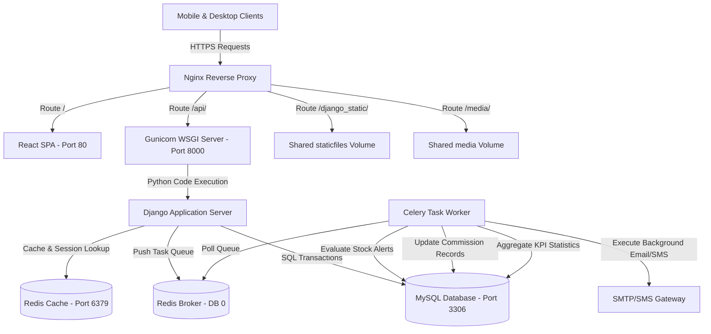
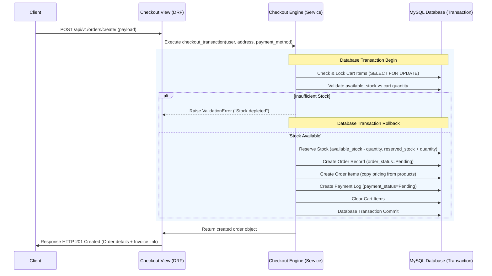
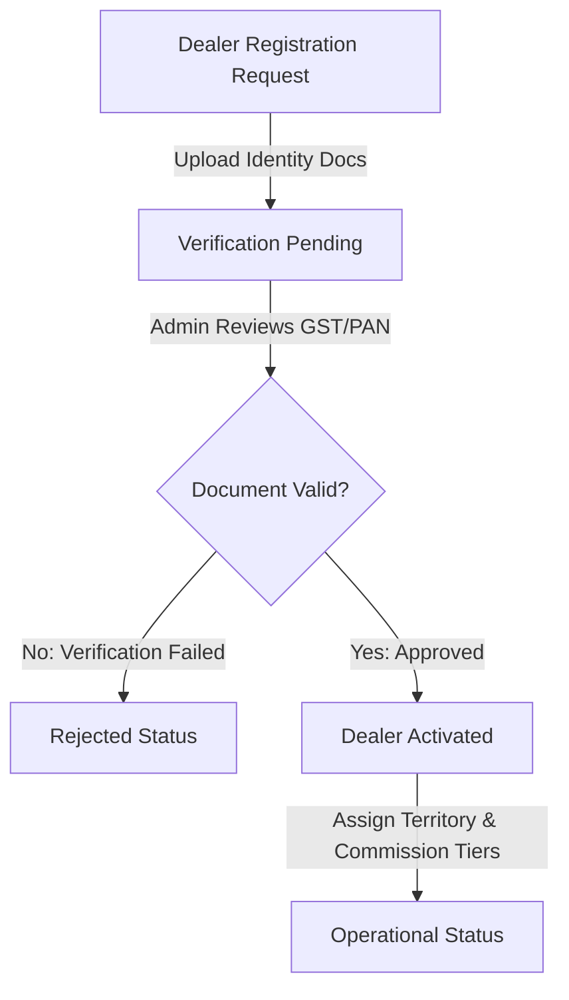
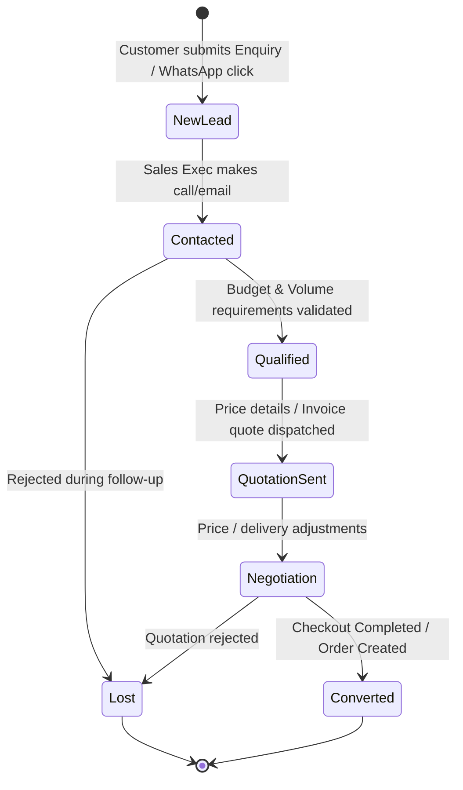

# Architecture Blueprint
## Project: Healthy Grains, Happy Families
### Enterprise System Design Document

---

## 1. System Architecture Diagram

This diagram displays the flow of data from customers, dealers, and admins down to the database and background processors.



---

## 2. Order Checkout Verification Engine Flow

When a user submits a checkout request, the backend executes a transactional validation engine before finalizing the order.



---

## 3. Dealer Onboarding & Approval Flow

Dealer registration involves multi-step document validation and status progression:



---

## 4. CRM Pipeline State Machine Flow

Customer interactions are automatically captured, prioritized, and tracked to closure.



---

## 5. Notification Dispatch Pipeline (Celery Queue)

To prevent API request blocks, messaging notifications are offloaded to Redis and executed asynchronously.

```
                  ┌──────────────┐
                  │ Django View  │
                  └──────┬───────┘
                         │ trigger event
                         ▼
             ┌───────────────────────┐
             │ Celery Asynchronous   │
             │ Tasks Broker (Redis)  │
             └───────────┬───────────┘
                         │
                         ├──────────────────────────┐
                         ▼                          ▼
                 ┌──────────────┐           ┌──────────────┐
                 │ Email Task   │           │ SMS Task     │
                 └──────┬───────┘           └──────┬───────┘
                        │ SMTP                     │ Twilio/SMS API
                        ▼                          ▼
               [Customer Inbox]           [Customer Phone]
```

---

## 6. Business Intelligence & Analytics Engine Design

The platform aggregates performance metrics using a layered reporting structure:

```
    ┌──────────────────────┐
    │  Database Tables     │
    └──────────┬───────────┘
               │
               ▼  SQL Aggregate Queries (Scheduled via Celery Cron)
    ┌──────────────────────┐
    │  Aggregation Layer   │
    └──────────┬───────────┘
               │
               ▼  Writes metrics
    ┌──────────────────────┐
    │  KPI Tracker Table   │
    └──────────┬───────────┘
               │
               ▼  Serves JSON API Payload
    ┌──────────────────────┐
    │   Reporting Views    │
    └──────────────────────┘
```

---

## 7. Performance & Caching Architecture (Redis)

Cache keys are structured with distinct TTL configurations and cache eviction policies:

```
[Cache Request] ──> [Check Redis Key]
                       ├──> (Hit)  ──> Return Data in < 5ms
                       └──> (Miss) ──> Query MySQL ──> Write Key to Redis
```

### 7.1 Cache Configurations
- **Product Details & Listings Cache**:
  - Key Format: `cache_product_list` or `cache_product_detail_{slug}`.
  - TTL: 24 Hours.
  - Eviction Trigger: Cleared on catalog edits using Django signals (`post_save`/`post_delete` on Product model).
- **Session Cache**:
  - Key Format: `session_{session_key}`.
  - TTL: 14 Days.
  - Backing Store: Database-backed cached sessions (Django session framework).

---

## 8. Hardened Nginx Reverse Proxy Configuration

Nginx enforces secure HTTP headers, terminations, and rate-limiting blocks before forwarding requests:

```nginx
# Rate Limiting Zones
limit_req_zone $binary_remote_addr zone=api_limit_zone:10m rate=15r/s;
limit_req_zone $binary_remote_addr zone=auth_limit_zone:10m rate=5r/s;

server {
    listen 443 ssl http2;
    server_name www.grainsforfamilies.com;

    # SSL Certificate Settings
    ssl_certificate /etc/letsencrypt/live/grainsforfamilies/fullchain.pem;
    ssl_certificate_key /etc/letsencrypt/live/grainsforfamilies/privkey.pem;
    ssl_protocols TLSv1.2 TLSv1.3;
    ssl_ciphers ECDHE-ECDSA-AES128-GCM-SHA256:ECDHE-RSA-AES128-GCM-SHA256:ECDHE-ECDSA-AES256-GCM-SHA384:ECDHE-RSA-AES256-GCM-SHA384;

    # Security Headers
    add_header X-Frame-Options "DENY" always;
    add_header X-Content-Type-Options "nosniff" always;
    add_header X-XSS-Protection "1; mode=block" always;
    add_header Content-Security-Policy "default-src 'self'; script-src 'self' 'unsafe-inline'; style-src 'self' 'unsafe-inline' https://fonts.googleapis.com; font-src 'self' https://fonts.gstatic.com; img-src 'self' data:; connect-src 'self';" always;
    add_header Strict-Transport-Security "max-age=63072000; includeSubDomains; preload" always;

    # Reverse Proxy endpoints
    location /api/ {
        limit_req zone=api_limit_zone burst=20 nodelay;
        proxy_pass http://backend:8000;
        proxy_set_header Host $host;
        proxy_set_header X-Real-IP $remote_addr;
        proxy_set_header X-Forwarded-For $proxy_add_x_forwarded_for;
        proxy_set_header X-Forwarded-Proto $scheme;
    }

    location /api/v1/auth/ {
        limit_req zone=auth_limit_zone burst=5 nodelay;
        proxy_pass http://backend:8000;
        proxy_set_header Host $host;
        proxy_set_header X-Real-IP $remote_addr;
    }
}
```

---

## 9. SEO Structured Data Design (JSON-LD Organization Schema)

The homepage and catalog files inject automated search engine crawler markups in JSON-LD formats:

```html
<script type="application/ld+json">
{
  "@context": "https://schema.org",
  "@type": "LocalBusiness",
  "name": "Healthy Grains, Happy Families",
  "image": "https://www.grainsforfamilies.com/static/images/logo.png",
  "@id": "https://www.grainsforfamilies.com/#business",
  "url": "https://www.grainsforfamilies.com",
  "telephone": "+919876543210",
  "priceRange": "$$",
  "address": {
    "@type": "PostalAddress",
    "streetAddress": "12 Main Grain Market Road",
    "addressLocality": "Indore",
    "addressRegion": "MP",
    "postalCode": "452001",
    "addressCountry": "IN"
  },
  "openingHoursSpecification": {
    "@type": "OpeningHoursSpecification",
    "dayOfWeek": [
      "Monday",
      "Tuesday",
      "Wednesday",
      "Thursday",
      "Friday",
      "Saturday"
    ],
    "opens": "09:00",
    "closes": "18:00"
  }
}
</script>
```

---

## 10. Database Indexing & Constraints Schema

To support sub-second reads and prevent race conditions:

### 10.1 Unique Indexes
- `orders.order_number`: Unique code generation block.
- `invoices.invoice_number`: Dynamic index for bill lookup.
- `products.slug`: URL slugs for catalog indexing.
- `dealers.dealer_code`: Sequential ID search logic index.
- `dealers.gst_number` & `dealers.pan_number`: String indexes to prevent duplicate business registrations.
- `enquiries.enquiry_number` & `leads.lead_number`: Fast search parameters for CRM boards.
- `kpi_trackers.metric_name`: Fast retrieve key for dashboard metrics loading.
- `seo_metadata.path`: Direct lookup hash for dynamic URL SEO configurations.

### 10.2 Composite & FK Indexes
- Index on `products(category_id, quality_grade_id)` for catalog searches.
- Index on `payments(payment_status, payment_method)` for admin revenue dashboards.
- Index on `order_items(order_id, product_id)` to speed up line item counts.
- Index on `inventory(product_id)` to secure transaction locks.
- Index on `dealers(territory_id, status)` for geolocated dealer mappings.
- Index on `leads(assigned_to, lead_status)` for Sales Executive tracking views.
- Index on `reports(report_type, generated_at)` to support admin file lists.
- Index on `audit_logs(user_id, created_at)` to trace actions history.

### 10.3 Audit Fields Abstract Class
Every table inherits from `AuditModel`:
```python
class AuditModel(models.Model):
    created_at = models.DateTimeField(auto_now_add=True)
    updated_at = models.DateTimeField(auto_now=True)
    created_by = models.ForeignKey(User, related_name="...", on_delete=models.SET_NULL, null=True)
    updated_by = models.ForeignKey(User, related_name="...", on_delete=models.SET_NULL, null=True)
    is_deleted = models.BooleanField(default=False)
    deleted_at = models.DateTimeField(null=True, blank=True)

    class Meta:
        abstract = True
```
Class records are physically soft-deleted to retain history logs.
